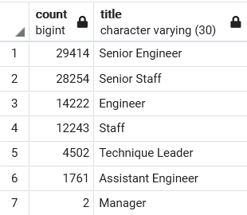

# Employee Database with SQL

## Overview

This project focused on creating a database to determine _who_ at Pewlett Hackard will be retiring and _how many_ postions will need to be filled as the 'silver tsunami' comes to bear on the company. 

### Purpose

We have been hired by Pewlett Hackard to help the company transintion its workforce as boomers begin retiring. Tasked with determining who exactly will be retiring and how many positions will need to be filled, we created a database to both alleviate the amount of work we need to put in currently, as well as update Pewlett Hackard's date organization and strategies for recovery. 

## Results

Below are major points found through our analysis:
- We found that 90,398 will need to be filled as boomers begin to retire. This is an incredibly large amount of positions and Pewlett Hackard may have trouble finding enough people to fill them all. However, with the mentorship program, this issue may be reduced.
  - Shown is a breakdown of positions by title, that will need to be filled:
    
- Engineering (both senior and otherwise) make up 43,636 positions that will need to be filled, making a majority of positions that require attention. However, this can be filled through promoting currrent members of the company that are doing well within the engineering departments and by hiring new members of the company from outside.
- Staffing is the other major area that will require new employees to take on positions. Between senior and normal staff, we are looking at 40,497 positions that will need to be filled. However, much like engineering, this gap can potentially be filled via internal promotions and aggressive marketing to those outside the company.
- There are only 1549 current employees that are eligible for mentorship positions, which is likely to cause problems as Pewlett Hackard attempts to transition to a younger workforce. 

## Summary

As noted above, 90,398 positions will need to be filled by Pewlett Hackard as the 'silver tsunami' begins to take effect. This is an incredibly large amount of positions and will require upper management to keep on top of retirments on a weekly - or even day-to-day - basis, to ensure the company maintains enough employees to continue operations.
Unfortunately, only 1549 employees are eligible for mentorship positions, leaving tens of thousands of positions unaccounted for. Pewlett Hackard's tranisition through the 'silver tsunami' will likely require massive investment into outside employees.

### Further Analysis

Then, provide 2 additional queries or tables that may provide more insight into the 'silver tsunami'
